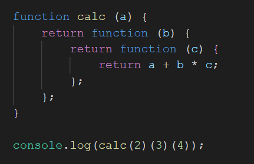

### Given the following code, what would be the output?

(if you cannot view the above image in your VSCode editor, please see it
on github.com)

1. 9
2. undefined
3. 24
4. 20
5. None of the above

Please explain your choice.

### Answer: 5, None of the above. The calc function is called with numbers at the very end with 
### a=2, b=3, and c=4 in the console.log message.The answer is 14 because we use the Order of 
### Operations (PEMDAS) to first multiply 3 and 4 f to equal 12 and then add 2 to equal 14. 

