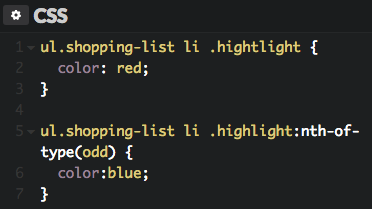

## Question A:

What color would you expect the item Sweet Halwa to show as and why?

### Answer: The color appears to be blue to show because it 
### selects every odd element of the nth child regardless of type
### to the parent. Also has a higher specficity.

## Question B:

What color would you expect the item "Sausage" to show as and why?

   

    

### Answer: The color to appears to be blue to show because 
### the id tag for sausage is set to a higher specificity. 

