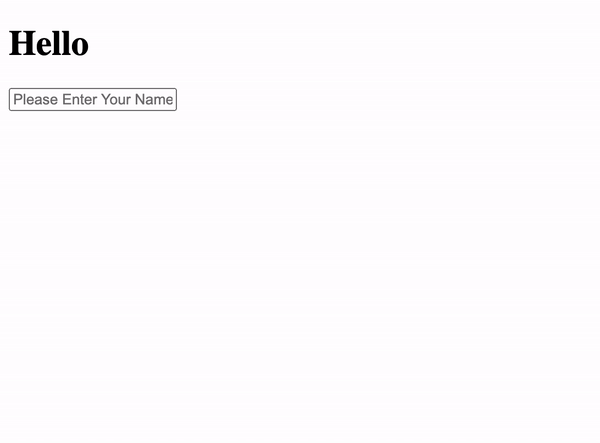

Included in this folder is a standard Create-React-App. With 2 
components, the first is the `Parent.js` component with a state of it's own called "name"
and in its JSX it renders that specific state variable within the h1 "Hello {name}". And below that it renders the "Child" component. In the Child component `Child.js` it has an input field that receives the text from the user. Your job is to pass the data from the input field in the child component back to the parent component. 

It should work like this when done:

## CHILD COMPONENT CODE
import React from 'react'

//Child Functional Component
//passed with props as argument(parameter)
const Child = props => {

    //Console.log message of the props 
    //when sending data from child
    //to parent.
    console.log(props)

    return (
        

            <input type="text" 
            placeholder="Please Enter Your Name"
            onChange={event => props.onChange(event.target.value)}
            />
        

    )
}

//Export Child Component
export default Child

//////////////////////////////////////////////////////////////////

## PARENT COMPONENT CODE
import React, { useState } from 'react'
import Child from './Child'

//Parent Functional Component
const Parent = () => {

  //Array Destructuring
  //name is a state variable 
  const [name, setName] = useState('')

  return (
    

      <h1>Hello {name}</h1>
      <Child onChange={value => setName(value)}/>
    

  )
}

//Export Parent Component
export default Parent
